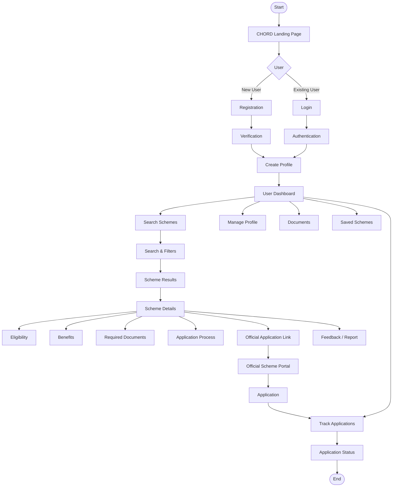
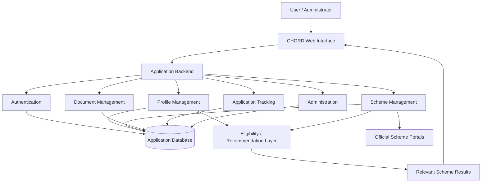

# CHORD — Central Hub for Organizing Resource and Distribution

> **Discover. Understand. Match. Apply.**

CHORD is a web-based platform designed to simplify the discovery and understanding of Government and Private sector schemes through a centralized interface.

Instead of searching across multiple websites, users can create a profile, discover relevant schemes, check eligibility, understand benefits and required documents, and access official application information.

---

## 📌 Project Overview

Many useful schemes are distributed across different portals and organizations. This can make it difficult for citizens to:

- Discover relevant schemes
- Understand eligibility requirements
- Identify required documents
- Understand application procedures
- Compare available opportunities
- Keep useful schemes organized

CHORD aims to provide a single, user-friendly platform for scheme discovery and assistance.

---

## 🎯 Objectives

The main objectives of CHORD are:

1. Centralize information about Government and Private sector schemes.
2. Provide profile-based scheme discovery.
3. Make eligibility information easier to understand.
4. Present benefits and required documents clearly.
5. Provide step-by-step application guidance.
6. Provide scheme search and filtering.
7. Allow users to save useful schemes.
8. Support application-related tracking.
9. Provide administrative tools for maintaining scheme information.
10. Provide a foundation for future AI-powered recommendations.

---

# 🌐 Website

The current frontend prototype contains interfaces for the major CHORD workflows:

| Page | Purpose |
|---|---|
| Landing Page | Introduces the CHORD platform |
| Login | User authentication interface |
| Profile | User information and profile management |
| Search | Scheme discovery and filtering |
| Scheme Details | Detailed scheme information |
| Document Upload | Document management interface |
| Application Tracking | Application status interface |
| Admin Dashboard | Administrative management |

The interface follows a dashboard-oriented design with navigation, cards, forms, scheme information sections, and administrative views.

---

# 🔄 User Flow



---

# 🏗️ High-Level Architecture



---

# 🛠️ Technology Stack

## Frontend

The current website prototype uses:

- **HTML5** — page structure
- **CSS** — styling and layout
- **JavaScript** — interaction and navigation

The project can be extended toward a component-based frontend architecture as development progresses.

## Backend

- **Python**
- **Django**
- REST-style API architecture

The backend manages users, profiles, schemes, documents, applications, feedback, and administrative operations.

## Database

The application uses a relational data model for core platform information.

The database layer is responsible for storing structured information related to:

- Users
- Profiles
- Schemes
- Documents
- Applications
- Bookmarks
- Feedback
- Scheme updates

## AI / Recommendation

The architecture provides a foundation for a future recommendation layer using:

- Python
- Pandas
- NumPy
- Scikit-learn
- Machine Learning models
- Large Language Model APIs where appropriate

The recommendation layer is intended to compare user information with scheme characteristics and produce more relevant results.

---

# 🧩 Core Modules

### 👤 User Management

- Registration
- Login
- Profile management
- Role-based access
- User preferences

### 🔎 Scheme Discovery

- Keyword search
- Scheme search
- Category filtering
- Location-based filtering
- Eligibility-oriented filtering
- Sorting

### 📋 Scheme Information

Each scheme can present:

- Overview
- Eligibility
- Benefits
- Required documents
- Application process
- Official application information
- FAQs
- Contact information

### 📁 Document Management

- Upload documents
- View documents
- Manage documents
- Document validation

### 📌 Application Tracking

Users can organize and monitor application-related information through the platform.

### ⭐ Feedback

Users can:

- Provide ratings
- Submit feedback
- Report incorrect information

### 👨‍💼 Administration

Administrators can manage:

- Scheme information
- Users
- Updates
- Reports
- Platform data

---

# 🤖 Recommendation Concept

The proposed recommendation architecture is:

```text
        USER PROFILE
             +
       SCHEME FEATURES
             +
         USER NEEDS
             │
             ▼
    ┌─────────────────┐
    │ Matching Engine │
    └────────┬────────┘
             │
             ▼
     Eligibility Check
             │
             ▼
      Relevance Score
             │
             ▼
    Recommended Schemes
```

The long-term objective is to make scheme discovery more personalized instead of presenting the same generalized results to every user.

---

# 🔗 External Integration — Future Scope

Potential integrations include:

- Government open-data sources
- Official scheme APIs
- Digital document platforms
- OCR/document-processing services
- Multilingual language services
- Location and public-service data
- AI/LLM services

These integrations are planned as the platform evolves.

---

# 🔐 Security

Security is a core consideration of the platform.

The production implementation should protect:

- User credentials
- Personal information
- Uploaded documents
- Authentication sessions
- Administrative access
- API access

Sensitive configuration and credentials must **never be committed to the public repository**.

---

# 🚀 Development Roadmap

```text
Requirement Analysis
        ↓
UI/UX Design
        ↓
Frontend Development
        ↓
Backend Development
        ↓
Database Integration
        ↓
Authentication
        ↓
Scheme Search & Filtering
        ↓
Document Management
        ↓
Application Tracking
        ↓
Eligibility Matching
        ↓
AI Recommendation
        ↓
Testing & Security
        ↓
Deployment
```

---

# 📁 Repository Structure

A simplified public project structure:

```text
CHORD/
│
├── frontend/
│   ├── pages/
│   ├── styles/
│   └── scripts/
│
├── backend/
│   ├── application/
│   ├── users/
│   ├── schemes/
│   └── documents/
│
├── docs/
│
├── tests/
│
└── README.md
```

> Internal implementation files, credentials, environment configuration, production infrastructure details, and private datasets should remain outside the public documentation/repository.

---

# 🧪 Testing

The platform should be validated through:

- Unit testing
- API testing
- Database testing
- Integration testing
- Frontend testing
- End-to-end testing
- Security testing
- Deployment testing

Important user journeys include:

```text
Registration
    ↓
Profile
    ↓
Search
    ↓
Filter
    ↓
Scheme Details
    ↓
Application Information
    ↓
Tracking
```

---

# 🌱 Future Enhancements

Possible future capabilities include:

- AI-powered personalized recommendations
- Multilingual interface
- Voice-based assistance
- OCR-based document processing
- Digital document integration
- Automatic eligibility alerts
- Improved application tracking
- Real-time scheme updates
- Expanded private-sector scheme coverage
- Advanced analytics

---

# 👥 Team

**Team:** Mavericks

**Project:** CHORD  
**Full Form:** Central Hub for Organizing Resource and Distribution

---

## ⭐ Vision

> **One Profile → Discover Relevant Schemes → Understand Eligibility → Prepare Documents → Apply through the Official Portal → Track Progress**

CHORD aims to make scheme discovery more centralized, understandable, and accessible for users.

---

## 🔒 Public Repository Notice

This repository's public documentation intentionally avoids exposing:

- Passwords or secret keys
- API tokens
- Private credentials
- Production database URLs
- Internal infrastructure configuration
- Private datasets
- Detailed authentication implementation
- Sensitive deployment configuration
- Internal testing credentials

Before pushing code to a public repository, verify that `.env`, credential files, local databases containing real user data, private datasets, and generated secret/configuration files are included in `.gitignore`.
